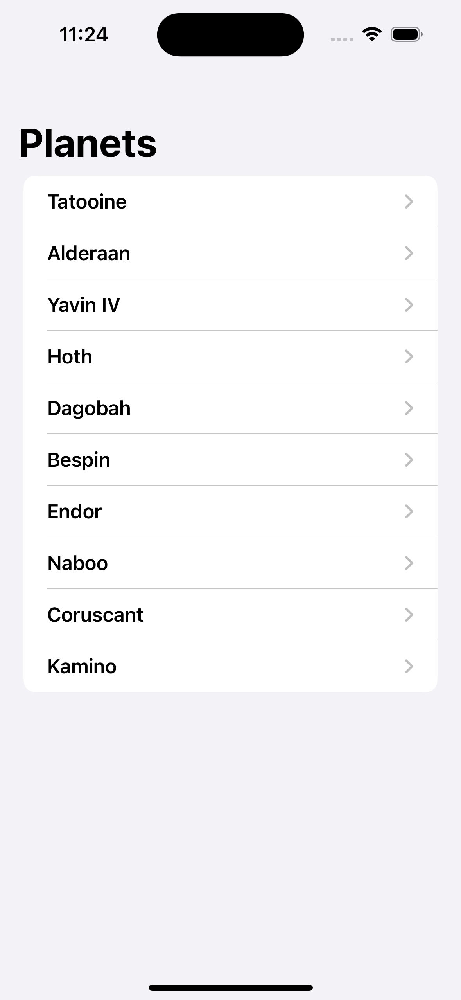
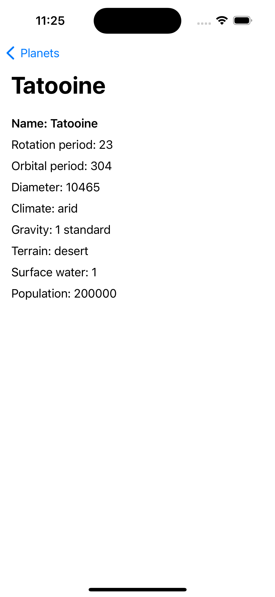

# PLANETS
This is an iOS app that displays a list of planets and their information. The app is written in Swift and uses Core Data for persistence and the MVVM architecture with the Repository pattern.

## SCREENSHOTS

